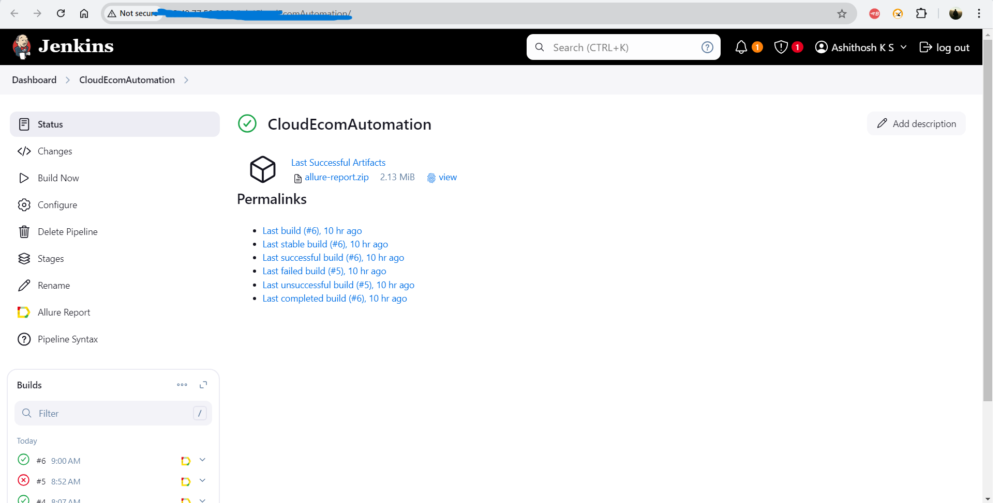
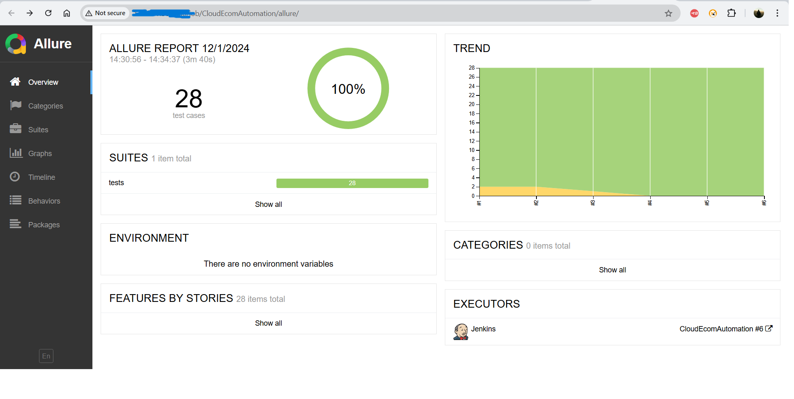
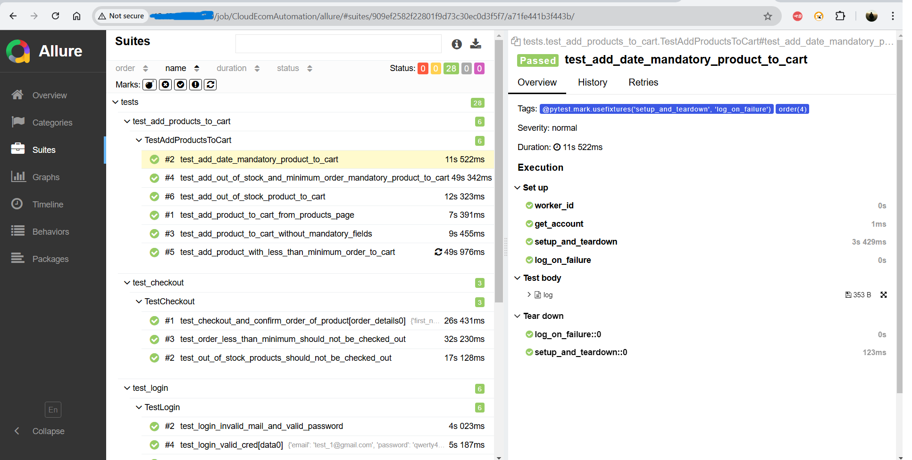

# CloudEcomAutomation

### A Hybrid Automation Framework for Testing an E-commerce Application Using Selenium, Pytest, Allure, Docker, Jenkins, and AWS.

---

## Table of Contents
1. [Project Overview](#project-overview)
2. [Features](#features)
3. [Technologies Used](#technologies-used)
4. [Project Setup](#project-setup)
5. [Running Tests Locally](#running-tests-locally)
6. [Running Tests with Cloud Integration](#running-tests-with-cloud-integration)
7. [Sample Reports](#sample-reports)
8. [Folder Structure](#folder-structure)
9. [Future Enhancements](#future-enhancements)
10. [Contributors](#contributors)
11. [Credits](#credits)
12. [License](#license)

---

## Project Overview

This project automates functional testing for a demo e-commerce web application https://tutorialsninja.com/demo. It is built on a robust hybrid automation framework using:
- **Page Object Model (POM)**: For maintainable and reusable code.
- **Selenium**: For web browser automation.
- **Pytest**: For scalable and flexible test execution.
- **Allure Reports**: For visually appealing test results.
- **Selenium Grid (Docker)**: For parallel and cross-browser testing.
- **Jenkins**: For CI/CD pipelines and scheduled test executions.
- **AWS EC2**: For running the automation framework on the cloud.

---

## Features

- **Functional Coverage**:
  - User login tests
  - Registration tests
  - Product search tests
  - Add to cart functionality
  - Cart and checkout page validations
- **Parallel Test Execution** with `pytest-xdist`.
- **Allure Integration** for detailed reporting.
- **Dockerized Selenium Grid** for distributed testing.
- **AWS EC2 Integration**:
  - Jenkins, Docker, and Selenium Grid deployed on AWS EC2 instance for cloud-based automation. 

---

## Technologies Used

- **Programming Language**: Python
- **Frameworks**: Pytest, Selenium, POM
- **Reporting**: Allure Reports
- **CI/CD**: Jenkins
- **Cloud Infrastructure**: AWS EC2
- **Containerization**: Docker and Docker Compose

---

## Project Setup

### 1. Prerequisites

- #### For Local System
  - **Python 3.9+** installed.
  - **Node.js Installed**
    - Allure CLI requires Node.js. Install it from the official [Node.js website](https://nodejs.org/).
    - Run the following command to install Allure CLI:
      ```bash
      npm install -g allure-commandline
      ```
    - Verify installation by running:
      ```bash
      allure --version
      ```
  - **Allure Command-line Tool**
    - Add Allure CLI to your system path if necessary.
  - **Python Dependencies**
    - Install the required Python libraries using `pip`:
      ```bash
      pip install -r requirements.txt
      ```

- #### For AWS EC2 Instance
    - Use an **AWS Linux 2023 AMI** (t3.medium instance type with 4GB memory is recommended).
    - Configure the AWS security group with inbound rules for HTTP (80), Selenium Grid (4444), Jenkins (8080), and SSH (22) to allow necessary access for the project
    - Access the instance via SSH using your private key:
      ```bash
      ssh -i "your-key.pem" ec2-user@<instance-public-ip>
      ```

  - **Java 21 Installed**
    - Install Java (Amazon Corretto 21) required for Jenkins and Allure CLI:
      ```bash
      sudo yum update -y
      sudo yum install java-21-amazon-corretto-devel -y
      ```

  - **Jenkins Installed**
    - Download the Jenkins WAR file and run Jenkins:
      ```bash
      wget https://updates.jenkins.io/download/war/2.479.1/jenkins.war
      java -jar jenkins.war
      ```

  - **Jenkins Plugins**
    - Install the following plugins in Jenkins:
    - ShiningPanda Plugin (optional for using python's venv)
    - Allure Jenkins Plugin
    - Git Plugin (by default added by jenkins during first time setup)
    - Pipeline Plugin (by default added by jenkins during first time setup)

  - **Allure CLI Installation**
    - Download Allure CLI
    ```bash
    wget https://github.com/allure-framework/allure2/releases/download/2.23.0/allure-2.23.0.tgz
    ```
    - Extract and Install Allure CLI
    ```bash
    tar -xvzf allure-2.23.0.tgz
    sudo mv allure-2.23.0 /opt/allure
    sudo ln -s /opt/allure/bin/allure /usr/bin/allure
    allure --version
    ```
  - **In Jenkins Global tool configurations**
    - Add Java configuration:
      - Name: `Java 21` (any name)
      - Provide installation path (e.g., `/usr/lib/jvm/java-21-amazon-corretto`)
      - Do not select "Install automatically" since Java is already installed
    - Configure Allure CLI
      - Name: `Allure CLI` (any name)
      - Provide installation path (e.g., `/opt/allure`)
  

  ### 2. Clone the Repository
  ```bash
  git clone https://github.com/rainman-77/CloudEcomAutomation.git
  cd CloudEcomAutomation
  ```
## Run Tests Locally
  ### 1. Setup in config.ini
&nbsp;&nbsp;&nbsp;&nbsp;&nbsp;&nbsp;&nbsp;&nbsp;set execution=parallel & run_environment=local
  ### 2. Run the test scripts in parallel mode()
   ```bash
   pytest tests/ --alluredir=reports -n 3
  ```
  ### 3. Generate Allure Reports
  ```bash
   allure generate reports --clean -o allure_report
   allure open allure_report
  ```

## Running Tests with Cloud Integration
  ### 1. Dockerized Selenium Grid
&nbsp;&nbsp;&nbsp;&nbsp;The docker-compose.yml file sets up a Selenium Hub and 3 browser nodes (Chrome, Firefox, Edge) for parallel testing.
  ### 2. Jenkins CI/CD
&nbsp;&nbsp;&nbsp;&nbsp;'Jenkinsfile' is configured for installing python,pip,docker & all other dependencies using requirements.txt file, then runs python scrips, generate allure reports
### 3. Creating New Jenkins Pipeline Job
- Navigate to the Jenkins dashboard and create a new pipeline job.
- Configure the pipeline to use your GitHub repository & also link the Jenkinsfile
- Set up build triggers like GitHub webhook or schedule (optional)
- Run the build & pipeline will handle the execution of test scripts, Docker, and report generation.

## Sample Reports from the Test Runs on AWS instance
### 1. Jenkins Pipeline Dashboard


### 2. Allure Test Summary


### 3. Allure Test Details


## Folder Structure

```plaintext
CloudEcomAutomation/
├── allure_report/          # Allure HTML reports
├── logs/                   # Logs generated during test execution
├── pageobjects/            # Page Object Model classes for different pages
├── reports/                # Allure JSON reports (used to generate HTML reports)
├── testdata/               # Test data files
├── tests/                  # Pytest scripts for various functionalities
├── utilities/              # Utility functions and helpers
├── docker-compose.yml      # Docker configuration for Selenium Grid
├── Jenkinsfile             # Jenkins pipeline configuration
├── pytest.ini              # Pytest configuration file
├── requirements.txt        # Python dependencies
└── README.md               # Project documentation
```

## Future Enhancements

- Add more test cases for payment gateway integration.
- Implement API testing for backend functionalities.

## Contributors

&nbsp;&nbsp;&nbsp;&nbsp;**Ashithosh K S** (Owner and Contributor)

## Credits

&nbsp;&nbsp;&nbsp;&nbsp;The `docker-compose.yml` file is adapted from [Selenium's official GitHub repository](https://github.com/SeleniumHQ/docker-selenium).

## License

This project is licensed under the [MIT License](LICENSE). Feel free to use, modify, and distribute the code with attribution.


